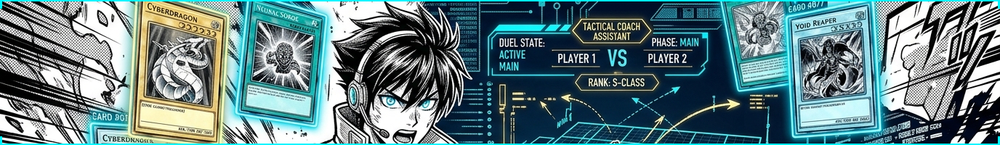
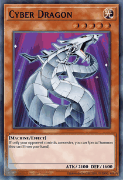
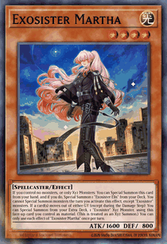
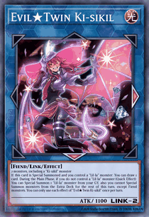
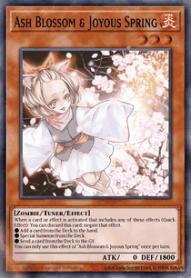
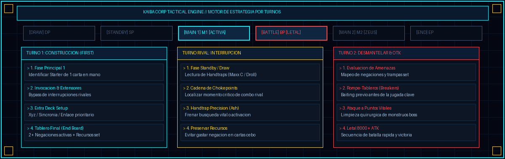
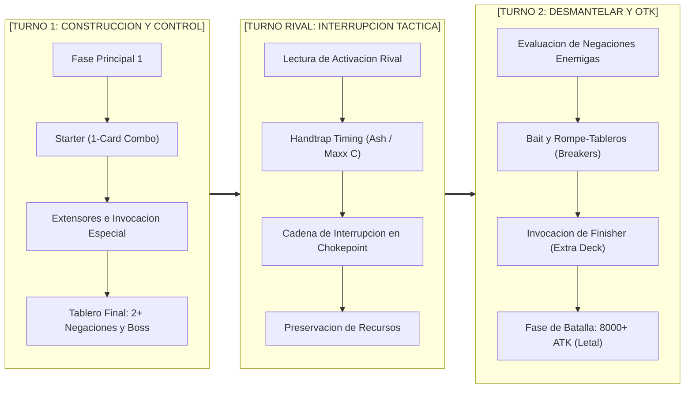

<p align="center">
  
</p>

<h1 align="center">[Yu-Gi-Oh] Master Duel Coach APP // Release v0.01</h1>

<p align="center">
  <i>HUD táctico de asistencia en tiempo real e inteligencia artificial para Yu-Gi-Oh! Master Duel.</i>
</p>

<p align="center">
  
  
  
  
  
</p>

<p align="center">
  <b>Multilingual Engine:</b>
  <code>[ES] Español</code> • 
  <code>[EN] English</code> • 
  <code>[FR] Français</code> • 
  <code>[DE] Deutsch</code> • 
  <code>[IT] Italiano</code>
</p>

---

> **Duel Master Coach** es un HUD táctico inteligente en tiempo real que se proyecta sobre **Yu-Gi-Oh! Master Duel**. Diseñado para el juego competitivo por turnos y la estrategia pura: analiza tu mano inicial, mapea la cronología de fases, calcula probabilidades de victoria (EV%), traza rutas de invocación paso a paso y te alerta de las trampas e interrupciones del adversario antes de cometer un error crítico.

---

<h2 align="center">Radar Tactico Holografico // Animated Cards Showcase</h2>

<p align="center">
  
  
  
  
</p>

<p align="center">
  <code>[CIBER DRAGÓN: OTK STARTER]</code> • 
  <code>[EXORMANA MARTA: 1-CARD COMBO]</code> • 
  <code>[EVIL*GEMELA: LINK ENGINE]</code> • 
  <code>[FLOR DE CENIZA: DISRUPT]</code>
</p>

---

<h2 align="center">Matriz Tactica por Turnos // Estrategia Pura</h2>

<p align="center">
  
</p>



### Cronologia Oficial de Fases (Tactical Phase Tracker)

| Fase | Codigo | Enfoque Tactico de la IA | Prioridad en Vivo |
| :--- | :---: | :--- | :--- |
| **Draw Phase** | `[DP]` | Monitoreo de robo inicial y efectos de activación rápida antes de Main Phase. | Detección temprana |
| **Standby Phase** | `[SP]` | Ventana de activación para efectos de mantenimiento y trampas de mano (*Maxx "C"*, *Droll*). | Control preventivo |
| **Main Phase 1** | `[M1]` | Invocación Normal prioritaria, cadenas de búsqueda, despliegue de Extra Deck y set de trampas. | **Fase Crítica de Combo** |
| **Battle Phase** | `[BP]` | Secuencia ofensiva, orden de ataques, cálculo de daño y confirmación de OTK letal (8000+). | **Fase de Remate** |
| **Main Phase 2** | `[M2]` | Montaje de defensas de respaldo (*Divine Arsenal AA-ZEUS*), posicionamiento y seteo secundario. | Consolidación |
| **End Phase** | `[EP]` | Resolución de efectos continuos, balance de mano y conteo de recursos para el siguiente turno. | Transición táctica |

---

## CAPÍTULO I: CARACTERÍSTICAS TÁCTICAS DEL HUD

```text
       +----------------------------------------------------------+
       |   KAIBA CORP LIVE TACTICAL RADAR                         |
       |   [FASE: DP > SP > M1* > BP > M2 > EP]   [WIN EV: 94%]   |
       |   [HERO PLAY] ---> [4-STEP COMBO] ---> [ALERT]           |
       |   [HAND SENSOR: MONSTER 4 | SPELL 1 | TRAP 0]            |
       +----------------------------------------------------------+
```

### 1. Radar de Fases y Turnos (Turn & Phase Pipeline)
- **Barra de Fases Interactiva:** Visualiza instantáneamente en qué punto del turno te encuentras (`[DP]`, `[SP]`, `[M1]`, `[BP]`, `[M2]`, `[EP]`).
- **Identificación de Rol de Turno:** Discierne entre *Turno 1 (Construcción)*, *Turno Rival (Interrupción)* y *Turno 2 (Ruptura & OTK)*.
- **Win Equity (EV%):** Medidor porcentual de ventaja matemática en cada fase de la partida.

### 2. Carta Heroica (Tu Jugada Inmediata)
- **Ilustración Oficial en Alta Resolución:** Visualiza la carta prioritaria con borde de animación holográfico foil.
- **Instrucción de Ejecución Directa:** Procedimiento paso a paso (*«1. Invoca de Modo Normal > 2. Activa efecto para buscar tu iniciador»*).
- **Justificación Táctica:** Explicación analítica del porqué se recomienda esta acción sobre otras opciones en mano.

### 3. Ruta de Combo en Cadena (4 Nodos Z)
- **Secuencia Holográfica en 4 Pasos:**
  1. `[STARTER]` Carta inicial y activación prioritaria.
  2. `[EXTENDER]` Búsqueda o invocación especial de soporte.
  3. `[EXTRA DECK]` Despliegue de Xyz, Sincronía, Fusión o Enlace.
  4. `[END BOARD]` Tablero final con negaciones activas o posición letal.
- Miniaturas reales para cada paso e inspección de texto al hacer clic.

### 4. Escáner de Mano en Tiempo Real (Visión por IA)
- Reconocimiento multimodal directo desde el cliente de Master Duel.
- Distintivos tácticos oficiales:
  - `[MONSTRUO EFECTO]` | `[MÁGICA]` | `[TRAMPA]` | `[RITUAL]` | `[SINCRONÍA]` | `[XYZ]` | `[ENLACE]`
- Clasificación de jugadas: `> JUGAR AHORA`, `Extensión`, `Guardar para Turno Rival`.

### 5. Radar de Interrupciones del Adversario
- Mapeo continuo de ventanas de riesgo contra handtraps comunes (*Ash Blossom*, *Maxx "C"*, *Nibiru*, *Infinite Impermanence*).
- Señalización de chokepoints para no malgastar recursos.

### 6. Dossiers de Estrategia por Arquetipo
- Base de datos táctica integrada con guías completas para cada mazo en `decks_estrategias/`.
- Acceso directo desde el HUD sin minimizar Master Duel.

---

## CAPÍTULO II: INSTALACIÓN Y PUESTA EN MARCHA

### 1. Requisitos del Sistema
- **Sistema Operativo:** Windows 10 u 11 (64-bit).
- **Python:** 3.10 o superior ([Descargar aquí](https://www.python.org/downloads/)).
- **Yu-Gi-Oh! Master Duel:** En ventana sin bordes o modo ventana.

### 2. Instalación desde Terminal
Clona el repositorio:
```bash
git clone git@github.com:Hyloozsgamer/yugioh-master-duel-coach.git
cd yugioh-master-duel-coach
```

Instala los módulos necesarios:
```bash
pip install -r requirements.txt
```

### 3. Configuración de Gemini AI
1. Copia la plantilla de entorno:
   ```bash
   cp .env.example .env
   ```
2. Añade tu API Key gratuita de Google Gemini ([Google AI Studio](https://aistudio.google.com/)):
   ```env
   GEMINI_API_KEY=tu_clave_secreta_aqui
   ```

### 4. Ejecución del Coach
Inicia con un doble clic:
```bat
INICIAR_COACH_EN_VIVO.bat
```
*(O ejecuta en consola: `python coach_live_overlay.py`)*

Pulsa **F5** en cualquier momento durante tu turno para actualizar el análisis táctico.

---

## CAPÍTULO III: MAPA ARQUITECTÓNICO

```text
yugioh-master-duel-coach
 +-- assets/                  # Banners panoramicos, diagramas de fase y cartas animadas
 |   +-- banner.png           # Banner panoramico manga (1376x200 px)
 |   +-- turn_strategy_radar.png # Diagrama tactico de turnos y fases
 |   +-- animated_cards/      # Holographic GIF gallery
 +-- coach/                   # Motor neuronal de estrategia
 |   +-- live_brain.py        # Vision multimodal y evaluacion tactica
 |   +-- i18n.py              # Diccionario multilenguaje (ES / EN / FR / DE / IT)
 +-- decks_estrategias/       # Dossiers de combate y combo lines por mazo
 +-- master_duel/             # Integracion y base de datos local
 |   +-- database/ygo_cards.db# Registro oficial de passcodes y metadatos
 +-- coach_live_overlay.py    # HUD tactico acoplado (Mobalytics UI)
 +-- INICIAR_COACH_EN_VIVO.bat# Lanzador directo
 +-- requirements.txt         # Dependencias
 +-- README.md                # Documentacion principal
 +-- RELEASE_NOTES_v0.01.md   # Notas de lanzamiento oficiales
```

---

## CAPÍTULO IV: DESCARGO SAGRADO (DISCLAIMER)

> *Yu-Gi-Oh!, Yu-Gi-Oh! Master Duel y todos sus elementos gráficos asociados son marcas registradas de **KONAMI Digital Entertainment**, **Kazuki Takahashi** y **Studio Dice / SHUEISHA, TV TOKYO**.*  
> 
> *Este proyecto es una herramienta de asistencia táctica creada por y para la comunidad con propósitos exclusivamente educativos, analíticos y de entrenamiento estratégico. No está afiliada ni respaldada oficialmente por Konami.*

---

<p align="center">
  <sub>Desarrollado para el juego competitivo por turnos y la estrategia pura.</sub>
</p>
